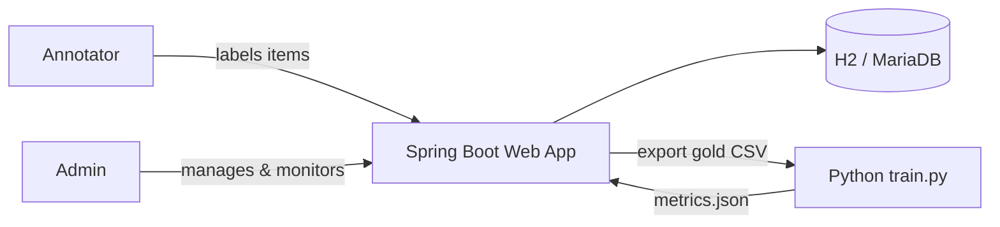

# NLP Annotation Platform

> A collaborative web platform for building, annotating and evaluating supervised NLP datasets — text classification, text-pair similarity and natural language inference (NLI).

<p align="left">
  
  
  
  
  
  
</p>

An academic mini-project that lets a team of annotators label datasets while an
administrator manages users, distributes work, monitors quality (inter-annotator
agreement, spam detection) and exports gold data to train a baseline classifier.

Developed by **Rida Aderkane** and **Mohamed Amine El Abidi**.

---

## Table of Contents

- [Features](#features)
- [Tech Stack](#tech-stack)
- [Architecture](#architecture)
- [Quick Start](#quick-start)
- [Running with MariaDB](#running-with-mariadb-optional)
- [Default Accounts](#default-accounts)
- [CSV Import Format](#csv-import-format)
- [Inter-Annotator Agreement](#inter-annotator-agreement)
- [Model Training](#model-training)
- [Project Structure](#project-structure)
- [Configuration](#configuration)
- [Authors](#authors)

---

## Features

### For Administrators
- **User management** — create annotators, enable/disable accounts, assign roles.
- **Dataset management** — create datasets, define their label sets and task type.
- **CSV import** — bulk-load items for single-text or text-pair tasks.
- **Work distribution** — automatically assign items to annotators with configurable overlap.
- **Quality monitoring** — inter-annotator agreement metrics and suspicious-annotator detection.
- **Statistics dashboard** — progress, throughput and per-annotator activity.
- **Data export** — download all annotations as CSV (gold standard).
- **Model training** — launch a baseline classifier and view accuracy / F1 metrics.

### For Annotators
- **Personal dashboard** — assigned tasks and progress at a glance.
- **Guided annotation** — label items one by one with the dataset's label set.
- **Multi-task support** — single text, text pairs and NLI premises/hypotheses.
- **Time tracking** — per-item annotation time (used for quality checks).

### Supported Task Types
| Task | Description | Example labels |
|------|-------------|----------------|
| `TEXT_CLASSIFICATION` | Classify a single text | `positive`, `negative`, `neutral` |
| `TEXT_PAIR` | Judge two texts | `similar`, `not_similar` |
| `NLI` | Premise/hypothesis inference | `entails`, `contradiction`, `neutral` |

---

## Tech Stack

| Layer | Technology |
|-------|-----------|
| Language | Java 17 |
| Framework | Spring Boot 3.5 (Web, Data JPA, Security, Validation) |
| View | Thymeleaf + Spring Security integration |
| UI | Bootstrap 5.3 (WebJars) |
| Database | H2 (embedded, default) · MariaDB 11.4 (optional) |
| CSV | Apache Commons CSV |
| Training | Python script invoked from the platform |
| Build | Maven (wrapper included) |

---

## Architecture



The application follows a classic layered Spring MVC design:

```
Controllers  →  Services  →  Repositories (Spring Data JPA)  →  Database
        ↑ Thymeleaf templates render server-side views
```

---

## Quick Start

The application ships with an **embedded H2 database** and seeds all required data
(users, labels, a sample dataset) automatically at startup — **no external database required**.

### Prerequisites
- Java 17
- Maven (or use the included `mvnw` wrapper)
- Python on `PATH` (optional — only for the training feature)

### Build & run

```powershell
.\mvnw clean package
java -jar target\app.jar
```

Then open **http://localhost:8080**.

> On macOS/Linux use `./mvnw` instead of `.\mvnw`.

---

## Running with MariaDB (optional)

To use MariaDB instead of the embedded database, start the bundled container and
override the connection settings:

```powershell
docker compose up -d

$env:DB_URL="jdbc:mariadb://localhost:3310/annotation_nlp"
$env:DB_USER="annotation"
$env:DB_PASSWORD="annotation"
$env:DB_DRIVER="org.mariadb.jdbc.Driver"

java -jar target\app.jar
```

> The MariaDB container is exposed on host port **3310** to avoid clashing with a
> local MySQL/MariaDB instance on `3306`.

---

## Default Accounts

| Username | Password | Role |
|----------|----------|------|
| `admin`  | `admin`  | Administrator |
| `user1`  | `user1`  | Annotator |
| `user2`  | `user2`  | Annotator |
| `user3`  | `user3`  | Annotator |

> These are demo credentials for local use only. Change them before any real deployment.

---

## CSV Import Format

**Single text** (classification / NLI premise):

```csv
id,text
1,The service was excellent.
```

**Text pair** (similarity / NLI):

```csv
id,text1,text2
1,The sky is blue.,The weather is clear.
```

---

## Inter-Annotator Agreement

When several annotators label the same items, the platform computes standard
agreement metrics per dataset:

- **Percent agreement** — pairwise agreement averaged across items.
- **Cohen's κ** — chance-corrected agreement for two annotators.
- **Fleiss' κ** — agreement for a fixed number of raters.
- **Krippendorff's α** — reliability across raters and missing data.

A built-in **spam / low-quality detector** flags annotators whose behaviour looks
suspicious — e.g. average annotation time below 2 seconds, or a single label used
more than 90% of the time.

---

## Model Training

From the admin training page, the platform exports the collected annotations and
launches a baseline classifier ([python/train.py](python/train.py)). Results are
written to `python/metrics.json` and displayed in the UI:

```json
{
  "accuracy": 0.86,
  "f1Score": 0.84
}
```

Configure the interpreter with the `PYTHON_EXECUTABLE` environment variable
(defaults to `python`).

---

## Project Structure

```
annotation-nlp-platform/
├── docker-compose.yml            # Optional MariaDB service
├── pom.xml                       # Maven build & dependencies
├── python/                       # Baseline training scripts
│   ├── train.py
│   └── test.py
└── src/main/
    ├── java/com/academic/annotation/
    │   ├── config/               # Security & data initialization
    │   ├── controller/           # MVC endpoints (admin / annotator / auth)
    │   ├── dto/                  # View & transfer objects
    │   ├── model/                # JPA entities (Dataset, Task, Annotation…)
    │   ├── repository/           # Spring Data repositories
    │   └── service/              # Business logic & metrics
    └── resources/
        ├── application.properties
        └── templates/            # Thymeleaf views (admin / annotator)
```

---

## Configuration

All settings live in [src/main/resources/application.properties](src/main/resources/application.properties)
and can be overridden via environment variables:

| Variable | Default | Purpose |
|----------|---------|---------|
| `PORT` | `8080` | HTTP port |
| `DB_URL` | embedded H2 | JDBC connection URL |
| `DB_USER` | `sa` | Database user |
| `DB_PASSWORD` | _(empty)_ | Database password |
| `DB_DRIVER` | `org.h2.Driver` | JDBC driver class |
| `PYTHON_EXECUTABLE` | `python` | Interpreter used for training |

---

## Authors

- **Rida Aderkane**
- **Mohamed Amine El Abidi**

> Academic mini-project — collaborative annotation platform for supervised NLP classification.
